# 03. 디자인 · UX

> 목표: **"스크린샷 한 장으로 설치하고 싶게, 첫 3초에 손이 가게."**
> 제약: Claude Code 가 100% 개발 → 외부 아트 툴 의존을 최소화하고 **코드로 그릴 수 있는 스타일**을 채택.

---

## 1. 아트 디렉션 — "크로노 판타지" (v2)

| 요소 | 방향 |
|---|---|
| 톤 | 깊은 남색 밤하늘 + **황동 시계 장치** + 원소별 네온 발광 |
| 형태 | 캐릭터는 **만화 마스코트형(2~2.5등신)** — 1.5절 캐릭터 디자인 가이드 참고. 이펙트·UI는 황동 시계 장치 + 원소 네온 |
| 질감 | 3가지 재질만 사용 (아래 1.1). 발광은 가산 합성, 모든 오브젝트에 바닥 그림자 |
| 배경 | 전투: 로마 숫자가 새겨진 **시계 문자판 석판** + 발광하는 시간의 균열. 로비·소환: 성운 밤하늘 + 시계탑 + 떠 있는 섬·톱니 |
| 이유 | ① 코드(Path/Canvas)로 100% 생성 가능 ② 수백 개 적이 있어도 가독성 우수 ③ 저사양 기기 성능 확보 ④ 스킨 = 색·패턴·트레일 변경으로 저비용 대량 생산 |

### 1.1 재질 규칙 (UI 품질의 핵심)
| 재질 | 쓰는 곳 | 구성 |
|---|---|---|
| **황동 (Brass)** | 누를 수 있는 주요 버튼, 시계 베젤, 활성 탭 메달, 리본 | 세로 그라데이션 `#FFF0BF → #F4C862 → #D99A32 → #B97722` + 위 1px 하이라이트 + 안쪽 테두리선 + 아래 3~4px 두께 그림자. 글자색 `#2A1906` |
| **남색 유리 (Glass)** | 정보 패널(HUD, 챕터, 확률, 통계) | `#28326E(72%) → #0E1332(86%)` + 위 1px 흰 하이라이트 + 황동 헤어라인(22% 불투명) + 배경 블러 |
| **보석 (Gem)** | 원소 룬, 재화, 등급 | 8각 컷 보석: 원소색 방사 그라데이션 + 면별 음영 + 흰 문양 + 좌상단 반사광. 룬은 황동 소켓에 박힌 형태 |
| 강철 (Steel, 보조) | 보조 버튼(자동 배치, 공유 등) | `#2C376F → #19204A` + 황동 헤어라인 |

- 한 화면에서 황동 주 버튼은 **1개**만 둔다(시선 집중). 나머지는 강철/유리.
- 알림 점(빨강)은 행동이 필요한 곳에만.

### 1.2 리소스 제작 파이프라인 (Claude Code 친화)
| 리소스 | 제작 방식 |
|---|---|
| 적·기사·투사체 | Kotlin `Path` + 그라데이션으로 절차적 생성 → 앱 시작 시 **텍스처 아틀라스(Bitmap)로 1회 베이크** (발광·그림자 포함) |
| 배경 | 시계 석판·성운은 해상도별로 1회 렌더링 후 캐시, 균열·먼지만 실시간 |
| 이펙트 | 파티클 시스템(코드), 발광은 사전 블러 처리한 원형 스프라이트 가산 합성, 베기 궤적은 두께가 변하는 호 |
| UI 아이콘 | Android Vector Drawable(XML) 직접 작성 — 24dp, 선 1.8dp, 둥근 끝 (시안의 아이콘 세트 18종) |
| 장비 아이콘 | 부위별 베이스 벡터 + 등급 배경(방사 그라데이션)·테두리 조합으로 자동 생성 |
| 앱 아이콘/스토어 그래픽 | 황동 시계 문자판 + 검 모양 바늘 (Adaptive Icon 벡터), 스토어 이미지는 게임 내 캡처 모드 |
| 폰트 | Pretendard(본문), Hahmlet(한글 제목), Cinzel(영문 로고·연출), Barlow Condensed(숫자) — 모두 OFL, 라이선스 파일 동봉 |
| 효과음 | jsfxr 류 파라미터를 코드/JSON 으로 저장 → 빌드 타임 WAV/OGG 생성, 또는 CC0 효과음 |
| BGM | CC0/상업 이용 가능 라이선스 음원(출처·라이선스 `LICENSES.md` 기록), 전투 1·보스 1·로비 1곡부터 |

> 선택 사항: 출시 전 품질 향상을 위해 대표 일러스트(로딩 화면, 스토어 피처 그래픽)만 외주/생성형 이미지로 교체 가능.
> 이 경우 **상업적 이용 라이선스 확인** 필수.

---

## 1.5 캐릭터 디자인 가이드 (v5 — 트렌드 반영 "Chrono Pop")

### 1.5.1 트렌드 분석 (2025~2026)
| 트렌드 | 내용 | 적용 |
|---|---|---|
| **촉각적 미니멀리즘 (Tactile minimalism)** | 무게감·질감이 느껴지는 재질 + 단순한 구성. 작은 썸네일에서도 고급스러워 보임 — 2026 모바일 아트에서 가장 강한 흐름 | 번쩍이는 플라스틱 광택 금지 → **무광 소프트 비닐 · 니트 · 브러시드 황동** |
| **표현적 기하학 (Expressive geometry)** | 형태 자체가 성격을 말하는 캐릭터 | 캐릭터마다 기본 도형 1개 + 비대칭 포인트 1개 |
| **아트토이 / "못생긴 귀여움"** | 라부부·크라이베이비 등 디자이너 토이 열풍. 약간 삐딱하고 감정이 있는 얼굴이 수집욕을 자극 | 몬스터는 **작은 송곳니·짝눈·심술/멍한 표정**, 적도 "갖고 싶은" 수집형 |
| **패션이 곧 캐릭터 (스트리트웨어)** | 슈퍼셀 mo.co 등 최신작은 캐릭터를 패션 브랜드처럼 다룸. 스킨이 매출·정체성의 중심 | 판타지 갑옷 + **후디·봄버·카고·하이탑 부츠·스티커** 레이어링 → 스킨 확장성 |
| **캐릭터 = 브랜드 자산** | 표정 시트, 배경 스토리, 의상 변주까지 설계 | 캐릭터별 표정 5종 · 의상 3종 · 한 줄 성격 설정 |

**v4(이전)가 촌스러워 보인 원인**: ① 거울 같은 플라스틱 광택 ② 원색 그대로(빨강·파랑·노랑 100%) ③ 모두 같은 "활짝 웃는" 얼굴 ④ 좌우 대칭·정면 포즈 ⑤ 옷·재질 디테일 부재.

### 1.5.2 규칙
| 항목 | 규칙 |
|---|---|
| 비율 | 2~2.5등신 유지 (가독성), 얼굴 이목구비는 **작고 단순하게** (점 눈·작은 입) |
| 재질 | 무광 소프트 비닐 + 천(니트·패딩) + 브러시드 금속. 하이라이트는 넓고 부드럽게 |
| 색 | **절제된 톤 2색 + 포인트 1색** (예: 잉크 네이비·크림 + 탠저린). 채도 100% 원색 금지 |
| 표정 | 기본 표정은 "여유·시크·심술·멍" 계열. 과장된 웃음은 연출용 표정 시트에만 |
| 포즈 | 3/4 각도, 무게중심 이동, 비대칭(한쪽 소매 걷음, 기울어진 볏 등) |
| 패션 | 모든 인간형 캐릭터는 판타지 + 스트리트웨어 레이어 1개 이상 |
| 렌더 | "프리미엄 피규어 제품 사진" 느낌 — 부드러운 확산광, 따뜻한 오프화이트 배경, 약한 접지 그림자 |
| 인게임 가독성 | 톤 다운 색은 어두운 전장에 묻히므로 **전투 스프라이트에만 1~2px 크림색 외곽선 + 접지 그림자**, 주인공은 금빛 외곽 글로우 추가 |

### 1.5.3 캐스트 (재정의)
| 캐릭터 | 한 줄 성격 | 디자인 키 |
|---|---|---|
| **세콘** (주인공) | 쿨한 척하지만 정 많은 꼬마 기사 | 크림 후디 + 네이비 갑주, 기울어진 초침 볏, 탠저린 니트 스카프, 스케이트보드처럼 멘 태엽 열쇠 |
| **노라** | 수다쟁이 천재 시계공 | 오버사이즈 작업 재킷, 고글, 스티커 붙은 공구함 |
| 글리치 몬스터 6종 | "시간의 틈에서 나온 장난꾸러기 아트토이" | 기본 도형 몸 + 무광 파스텔/더스티 톤 + 네온 포인트, 작은 송곳니·짝눈 |
| 펫 | 포근한 수집형 인형 | 펠트·플러시 재질, 무광 |

## 2. 디자인 토큰

### 2.1 색상
| 토큰 | HEX | 용도 |
|---|---|---|
| `night.0` | `#05071A` | 가장 깊은 배경, 화면 가장자리 비네트 |
| `night.1` | `#0A0E22` | 앱 배경, 하단 탭 바 |
| `glass.top` / `glass.bottom` | `#28326E` / `#0E1332` | 유리 패널 그라데이션 |
| `line.subtle` | `#2A3470` | 비활성 테두리, 빈 슬롯 |
| `line.brass` | `#FFDDA0` 22% | 패널 헤어라인 |
| `text.primary` | `#F3F1EA` | 본문 |
| `text.secondary` | `#A8B0D4` | 보조 텍스트 |
| `text.tertiary` | `#6E78A8` | 비활성 탭, 캡션 |
| `brass.hi` / `brass` / `brass.lo` | `#FFE9A8` / `#E8B54A` / `#8C5A1B` | 황동 재질, 강조 숫자 |
| `ink.onBrass` | `#2A1906` | 황동 위 글자 |
| `danger` | `#FF4D6D` | 피격, 경고, 알림 점 |
| `success` | `#52E08E` | 회복, 수령, 경험치 |

**원소 색 (색약 대응: 반드시 문양과 함께 사용)**
| 원소 | HEX | 문양 |
|---|---|---|
| 화 | `#FF6B35` | 불꽃 |
| 빙 | `#6EC8FF` | 눈꽃 |
| 뇌 | `#FFE14D` | 번개 |
| 풍 | `#5EF2B5` | 바람 줄기 |
| 광 | `#FFF1B8` | 태양 |
| 암 | `#A66BFF` | 초승달 + 별 |

**등급 색**
| 일반 | 희귀 | 영웅 | 전설 | 신화 |
|---|---|---|---|---|
| `#9AA3B5` | `#4DA3FF` | `#B65CFF` | `#FFB23F` | `#FF4D8D` + 무지개 테두리 회전 |

### 2.2 타이포그래피 (sp, 시스템 글꼴 크기 설정 반영)
| 토큰 | 크기/굵기 | 용도 |
|---|---|---|
| `logo` | 30~46 / Cinzel 800 | "STAGE CLEAR", "LEVEL UP", 로고 (영문만) |
| `title` | 16~20 / Hahmlet 800 | 화면 제목, 반응 이름("화염폭풍!"), 버튼 라벨 |
| `body` | 13~15 / Pretendard Regular | 본문 |
| `caption` | 10~12 / Pretendard Medium | 보조 정보 |
| `number` | 14~24 / Barlow Condensed 700, 고정폭 숫자 | 타이머, 재화, 데미지(기울임 + 외곽선) |

### 2.3 간격·모서리·모션
- 간격: 4 / 8 / 12 / 16 / 24 / 32 dp
- 모서리: 카드 16dp, 버튼 12dp, 칩 999dp(원형)
- 모션: 기본 200ms `FastOutSlowIn`, 팝업 등장 250ms 스프링(감쇠 0.7), 보상 획득 400ms
- 터치 영역: 최소 48dp

---

## 3. 화면 구성 (세로, 한 손 엄지 영역 우선)

### 3.1 화면 흐름
```
스플래시(2초, PGS 자동 로그인 백그라운드)
   └─ 첫 실행: 바로 튜토리얼 전투 → 로비
   └─ 재실행: 로비 (야영지 보상 팝업)

로비 (하단 탭 5개)
 ├─ 상점        : 소환 / 패키지 / 크리스탈 / 무료 상자
 ├─ 기사        : 스탯, 장비 6부위, 합성, 코스튬
 ├─ ★ 전투(중앙) : 챕터 지도, 스테이지 시작, 던전·탑·시련 입구, 야영지
 ├─ 룬          : 룬 도감, 숙련, 시작 룬 슬롯, 빌드 코드 불러오기
 └─ 이벤트      : 시즌 패스, 출석, 퀘스트, 업적(PGS)

설정: 사운드/진동/그래픽 품질/플래시 감소/언어/계정(PGS 연동 상태, 클라우드 저장·불러오기)/약관·개인정보/확률 정보/고객지원
```

### 3.2 전투 HUD
```
┌──────────────────────────────┐
│ [일시정지]   웨이브 3/10  1:24 │  ← 상단: 진행 정보 (손이 안 닿아도 되는 정보만)
│ 나 ███████░░ vs ██████ 그림자 │  ← 그림자 라이벌 게이지 (재도전 시)
│                              │
│                              │
│            (필드)             │
│             🛡 기사            │  ← 기사 아래 HP 바
│                              │
│                              │
│ 경험치 바 ████████░░░ Lv.7    │
│                     ╭──────╮ │
│                     │ 룬시계 │ │  ← 우하단: 룬 시계(지름 96dp), 탭하면 확대 보기
│                     ╰──────╯ │
└──────────────────────────────┘
```
- 필드 중앙~하단이 드래그 영역. 룬 시계는 **반투명**, 바늘 회전 애니메이션 + 발동 칸 번쩍임.
- 설정에서 "왼손 모드"(룬 시계 좌하단) 제공.

### 3.3 레벨업 · 룬 선택 화면
- 화면 하단 1/2 에 룬 카드 3장(원소 색 테두리, 아이콘, 이름, 1줄 설명, "반응 가능!" 배지).
- 상단 1/2 에 확대된 룬 시계. 카드를 **시계로 드래그**하여 배치 → 놓을 수 있는 칸에 반응 미리보기
  ("화염폭풍 발생!" 같은 태그와 점선 화살표).
- "자동 배치" 버튼(추천 칸 하이라이트) / "리롤(광고)" 버튼.

### 3.4 소환 화면
- 중앙 시계탑 문 + 하단 1회/10회 버튼 + 좌상단 "확률 정보" 버튼 **항상 노출**.
- 천장 카운터("전설 확정까지 23회"), 마일리지 게이지 상시 표시.

---

## 4. 타격감 (Game Feel / Juice) 체크리스트

| 순간 | 연출 |
|---|---|
| 적 피격 | 흰색 플래시 1프레임, 넉백 짧게, 데미지 숫자 튀어오름(치명타는 크게·금색) |
| 적 처치 | 도형이 파편으로 쪼개짐(4~6조각), 경험치 결정 튀어나옴 |
| 대량 처치 | 콤보 카운터(10/50/100 킬마다 효과음 피치 상승) |
| 룬 발동 | 시계 칸 번쩍임 → 필드에 해당 원소 이펙트, 원소별 고유 효과음 |
| 원소 반응 | 반응 이름 팝업 + 화면 가장자리 원소색 비네트 + **히트스톱 40ms** |
| 정오 칸 발동 | 종소리 + 바늘 금빛 트레일 |
| 레벨업 | 0.3초 슬로모션 → 일시정지, 경험치 바 폭발 |
| 보스 등장 | 화면 가장자리 경고 줄무늬, BGM 전환, 보스 이름 카드 |
| 피격(기사) | 가벼운 화면 흔들림(설정에서 끄기 가능), 진동 20ms |
| 결과 화면 | 재화 카운트업, 신규 기록 시 그림자가 부서지는 연출 |

- 진동: `HapticFeedbackConstants` 우선, 설정에서 끄기 가능.
- **플래시 감소 모드**(광과민성 대응): 섬광·흔들림·비네트 강도 30% 로 제한.

---

## 5. 사운드 가이드
- 효과음 채널 우선순위: 기사 피격 > 원소 반응 > 룬 발동 > 적 처치(동시 재생 수 제한 8, 같은 소리 50ms 내 중복 재생 금지).
- 처치음은 무작위 피치 ±5% 로 반복 피로 감소.
- `SoundPool`(효과음) + `MediaPlayer`/ExoPlayer(BGM), 오디오 포커스 처리(통화·다른 앱 재생 시 음소거).

---

## 6. 접근성 · 현지화
- 원소는 색 + 모양 이중 표기, 데미지 숫자 크기 옵션(작게/보통/크게).
- 시스템 글꼴 크기 최대 130% 까지 레이아웃 깨짐 없음(Compose 프리뷰 테스트).
- 모든 문자열은 `strings.xml`(ko 기본, en 동시 작성). 문장 안에 숫자·이름은 포맷 인자로.
- TalkBack: 로비·상점·설정 UI 에 `contentDescription` 제공 (전투 화면 제외).

---

## 7. 스토어(ASO) 크리에이티브 방향
- **짧은 설명(80자)**: "시계에 룬을 놓아라! 한 손으로 즐기는 5분 로그라이트 액션"
- 스크린샷 1: 원소 반응이 터지는 전투 장면 + 카피 "배치하면 폭발한다"
- 스크린샷 2: 룬 시계 배치 화면 + "12칸의 시계, 무한한 빌드"
- 스크린샷 3: 그림자 라이벌 + "어제의 나를 이겨라"
- 스크린샷 4: 장비·소환 + "전설 확정 천장 50회"
- 스크린샷 5: 야영지 + "쉬는 동안에도 강해진다"
- 프로모션 영상(30초): 첫 5초에 원소 반응 연쇄 → 숏폼(유튜브 쇼츠/틱톡) 광고 소재와 공용.

---

## 8. 화면 시안 (v5 — "Chrono Pop" 트렌드 반영)

- 인터랙티브 시안: [design/mockups.html](design/mockups.html) (브라우저로 열기, `design/art/` 이미지 사용)
- 전체 개요: 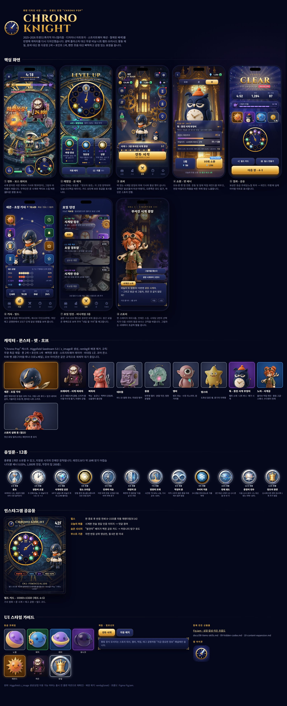

| 전투 | 룬 배치 | 로비 | 소환 |
|---|---|---|---|
| 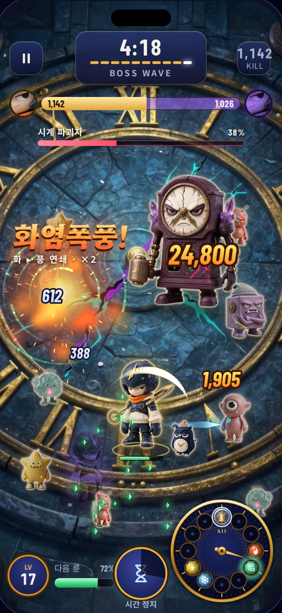 | 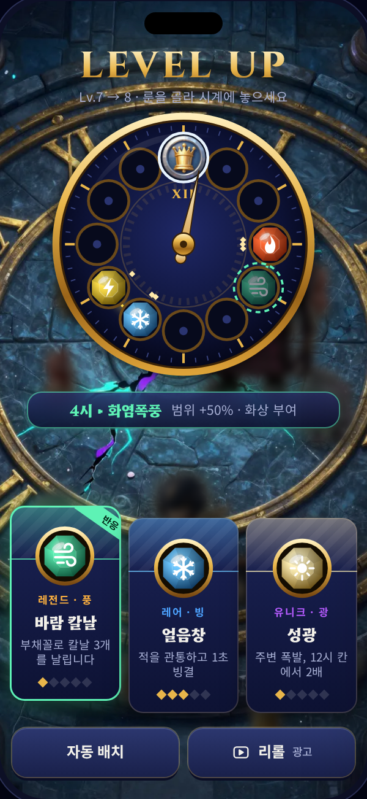 | 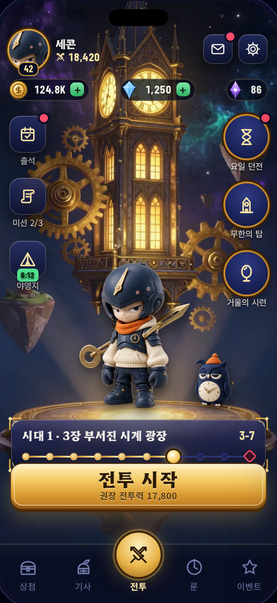 | 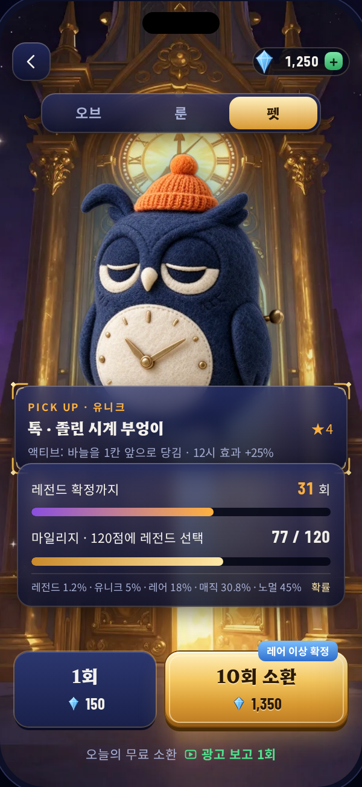 |

| 결과 | 기사·빌드 | 요일 던전 | 스토리 |
|---|---|---|---|
| 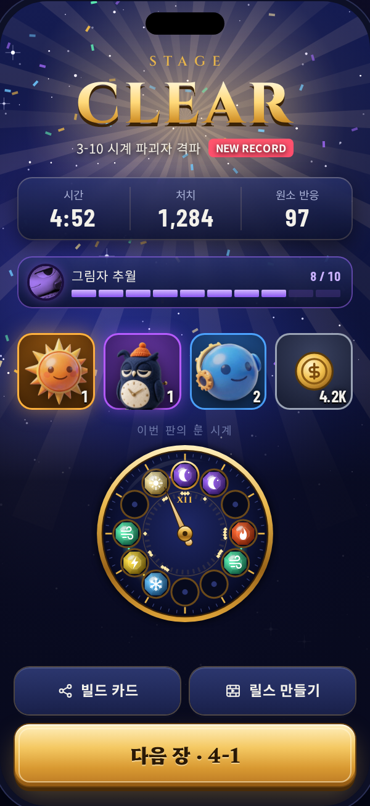 | 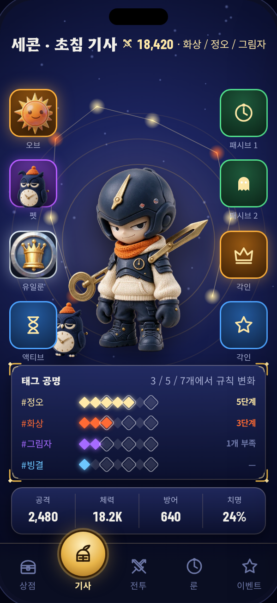 | 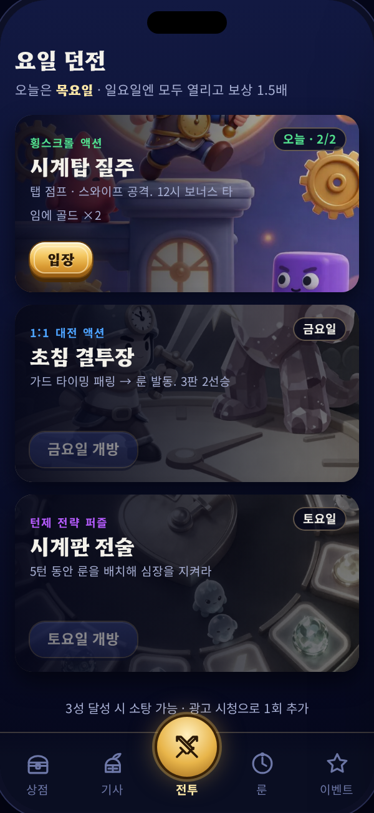 | 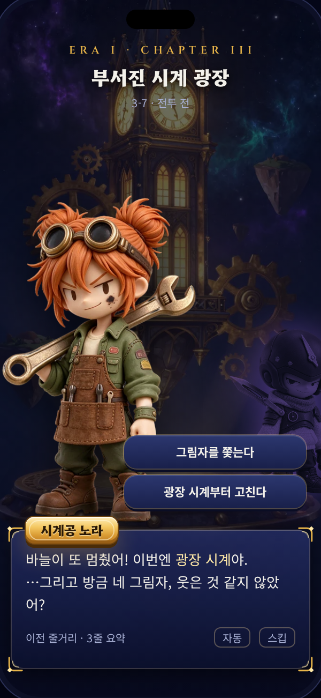 |

- 캐릭터·몬스터·펫·오브 갤러리: 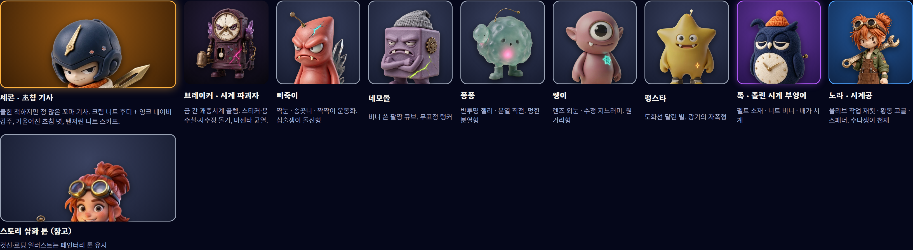
- 유일룬 12종: 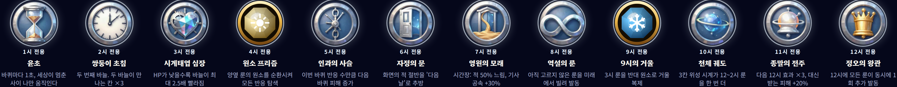
- 성장·합성·히든 흐름도 (FigJam): https://www.figma.com/board/XAPBKX8HR1LHIAHHtWLXD8

## 9. 아트 제작 파이프라인 (v3에서 변경)

| 단계 | 도구 | 비고 |
|---|---|---|
| 원화 생성 | Higgsfield `seedream_5_0_flash`(1장 0.5크레딧, 참조 이미지 지원) · `z_image`(0.15) / 보조: Canva, ElevenLabs | 캐릭터 공통 프롬프트(v5): "collectible designer art toy figure, premium product photography, plain warm off-white seamless backdrop, soft diffused studio light, tactile matte soft-touch vinyl / knit / felt / brushed brass, no glossy plastic shine, curated muted palette with one accent, small simplified face, subtle asymmetry, streetwear layer" / 배경·삽화: "stylized semi-realistic painterly" |
| 배경 제거 | 로컬 `rembg` (isnet-general-use) | 무료. Higgsfield 배경 제거는 1크레딧이라 사용하지 않음 |
| 최적화 | Pillow → WebP (스프라이트 512px, 배경 720×1280) | 원본 PNG는 `design/art/_raw/`(git 제외) |
| 흐름도 | Figma FigJam `generate_diagram` | |
| 게임 적용 | 원화 → Higgsfield `autosprite`(캐릭터 이미지 → 대기·이동·공격 스프라이트 시트 자동 생성) 또는 참조 이미지 기반 추가 생성 | 게임 내에서는 기하학 이펙트(코드)와 합성 |

- **라이선스 체크(출시 전 필수)**: 생성 플랫폼의 상업 이용 조건(무료 플랜 포함 여부)을 확인하고, 필요 시 유료 플랜에서 최종 에셋을 재생성한다. 결과를 `LICENSES.md` 에 기록.
- **일관성 유지**: 캐릭터별 "기준 원화"를 참조 이미지로 고정하고, 스킨·표정 변형은 참조 기반 편집으로 만든다.
